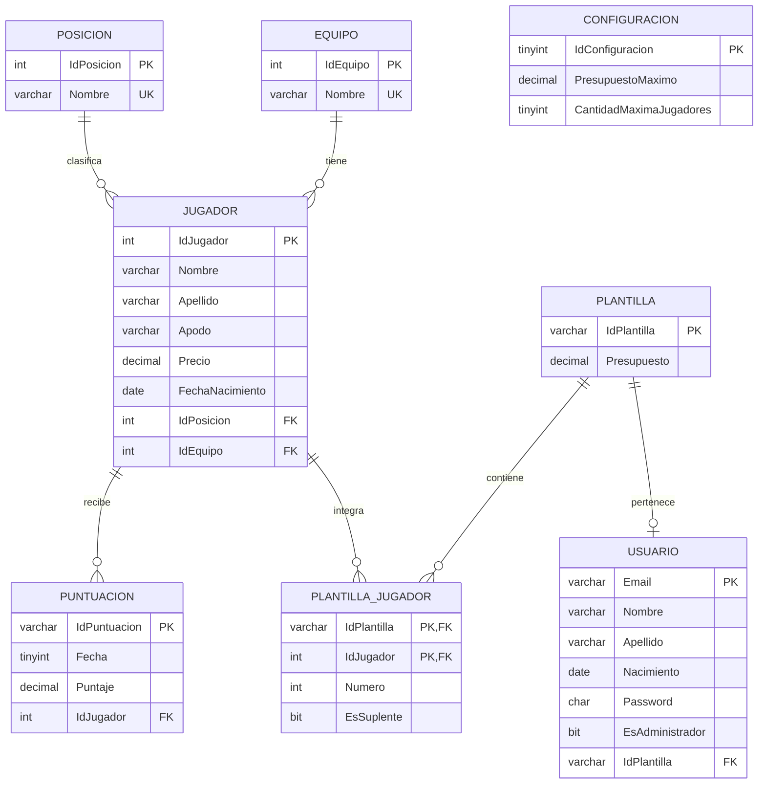

# Diagrama entidad-relacion

Cada usuario puede tener como maximo una plantilla y cada plantilla como maximo un usuario. La tabla `PlantillaJugador` representa la relacion muchos-a-muchos entre plantillas y jugadores. La tabla `Configuracion` guarda el presupuesto compartido y el limite actual de jugadores por plantilla.
