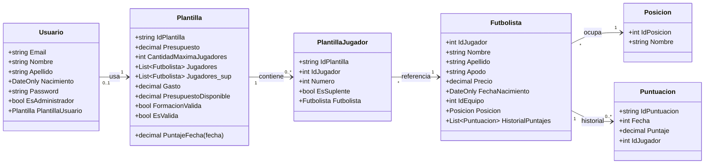

# Diagrama de clases

```mermaid
classDiagram
direction LR
    class Usuario {
        +string Email
        +string Nombre
        +string Apellido
        +DateOnly Nacimiento
        +string Password
        +bool EsAdministrador
        +Plantilla PlantillaUsuario
    }
    class Plantilla {
        +string IdPlantilla
        +decimal Presupuesto
        +int CantidadMaximaJugadores
        +List~Futbolista~ Jugadores
        +List~Futbolista~ Jugadores_sup
        +decimal Gasto
        +decimal PresupuestoDisponible
        +bool FormacionValida
        +bool EsValida
        +decimal PuntajeFecha(fecha)
    }
    class Futbolista {
        +int IdJugador
        +string Nombre
        +string Apellido
        +string Apodo
        +decimal Precio
        +DateOnly FechaNacimiento
        +int IdEquipo
        +Posicion Posicion
        +List~Puntuacion~ HistorialPuntajes
    }
    class Posicion {
        +int IdPosicion
        +string Nombre
    }
    class PlantillaJugador {
        +string IdPlantilla
        +int IdJugador
        +int Numero
        +bool EsSuplente
        +Futbolista Futbolista
    }
    class Puntuacion {
        +string IdPuntuacion
        +int Fecha
        +decimal Puntaje
        +int IdJugador
    }

    Usuario "0..1" --> "1" Plantilla : usa
    Plantilla "1" --> "0..*" PlantillaJugador : contiene
    PlantillaJugador "*" --> "1" Futbolista : referencia
    Futbolista "*" --> "1" Posicion : ocupa
    Futbolista "1" --> "0..*" Puntuacion : historial
```
