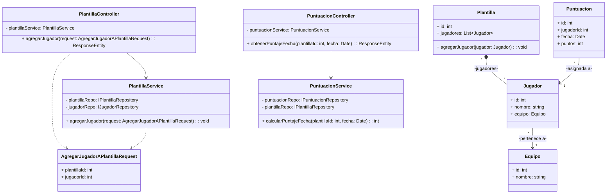

```mermaid
classDiagram
    class AgregarJugadorAPlantillaRequest {
        + plantillaId: int
        + jugadorId: int
    }

    class PlantillaController {
        - plantillaService: PlantillaService
        + agregarJugador(request: AgregarJugadorAPlantillaRequest): ResponseEntity
    }

    class PuntuacionController {
        - puntuacionService: PuntuacionService
        + obtenerPuntajeFecha(plantillaId: int, fecha: Date): ResponseEntity
    }

    class PlantillaService {
        - plantillaRepo: IPlantillaRepository
        - jugadorRepo: IJugadorRepository
        + agregarJugador(request: AgregarJugadorAPlantillaRequest): void
    }

    class PuntuacionService {
        - puntuacionRepo: IPuntuacionRepository
        - plantillaRepo: IPlantillaRepository
        + calcularPuntajeFecha(plantillaId: int, fecha: Date): int
    }

    class Plantilla {
        + id: int
        + jugadores: List~Jugador~
        + agregarJugador(jugador: Jugador): void
    }

    class Jugador {
        + id: int
        + nombre: string
        + equipo: Equipo
    }

    class Equipo {
        + id: int
        + nombre: string
    }

    class Puntuacion {
        + id: int
        + jugadorId: int
        + fecha: Date
        + puntos: int
    }

    %% Dependencias (líneas punteadas)
    PlantillaController ..> AgregarJugadorAPlantillaRequest
    PlantillaService ..> AgregarJugadorAPlantillaRequest

    %% Asociaciones de inyección (líneas continuas con flecha)
    PlantillaController --> PlantillaService
    PuntuacionController --> PuntuacionService

    %% Relaciones de Dominio (Composición y Asociaciones directas)
    Plantilla "1" *-- "*" Jugador : -jugadores-
    Jugador "*" --> "1" Equipo : -pertenece a-
    Puntuacion "*" --> "1" Jugador : -asignada a-
```